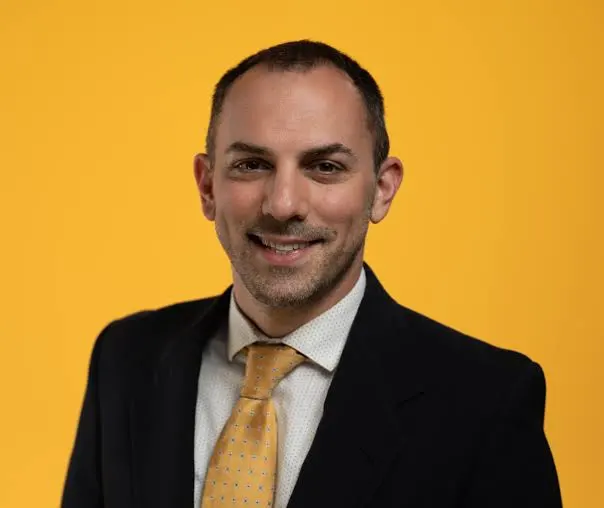

## About

Dr. Stephen Secules is the **Director of Integrative Engineering and First Year Engineering** and an **Associate Professor of Mechanical Engineering** at the **University of New Mexico**.

He holds a **Bachelor of Arts in Engineering Sciences**, a **Bachelor of Engineering**, a **Master of Science in Architectural Sciences**, and a **PhD in Curriculum & Instruction**. Dr. Secules also spent **five years in acoustical engineering** as a building consultant, supporting architects and building owners with sound, communication, and vibration design.

---

## Academic Appointments

- Associate Professor, Mechanical Engineering, University of New Mexico  
- Director, Integrative Engineering and First Year Engineering, University of New Mexico  
- Visiting Faculty, Purdue University  
- Visiting Faculty, University of Georgia  
- Assistant Professor, Florida International University (SUCCEED founding member)

---

## Research Interests

Dr. Secules’ research applies **critical qualitative methods** to study everyday educational settings in engineering. His work emphasizes shifting engineering education towards **equity and inclusion**.

- Founder of the **Equity, Culture, and Social Justice in Education Division** of ASEE.  
- Editorial Board Member: *Journal of Engineering Education*.  
- Editorial Board Member: *International Handbook for Engineering Education Research*.

---

## Scholarly Publications

Selected works include:
- Publications on equity and culture in engineering education.  
- Research on qualitative methods in curriculum & instruction.  
- Contributions to *Journal of Engineering Education* and ASEE conferences.  

[Full list of publications →](#)

---

## Education Labs

**Integrative Engineering and First Year Engineering Programs** at UNM focus on:
- Inclusive engineering pedagogy.  
- Supporting first-generation and underrepresented students.  
- Designing equitable classroom experiences.  

---

## Events & News

Stay tuned for:
- Upcoming conference presentations.  
- Workshops on equity and inclusion in engineering education.  
- Community outreach initiatives.  

[See all events →](#)

---

## Past Professional Experience

Before academia, Dr. Secules worked in **acoustical engineering** as a consultant:
- Assisted in the design and remediation of building acoustics.  
- Specialized in vibration, communication, and sound quality in built environments.  

---

## For Students

### Previous Students
- Mentored undergraduate and graduate students at FIU, Purdue, and UNM.  
- Alumni now working in **academia**, **STEM education policy**, and **industry**.  

### Prospective Students
If you are interested in **equity-centered research in engineering education** or wish to join the **Integrative Engineering program at UNM**, please reach out to discuss opportunities.

[Contact Dr. Secules →](mailto:secules@unm.edu)
